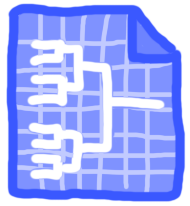
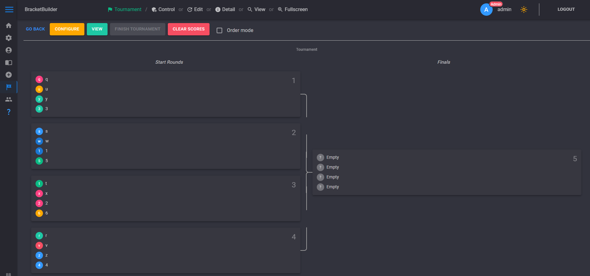

 

  
  <h3 align="center">Bracket Builder</h3>

  

    A tool for building brackets for tournaments.
     
     
  

   

## Table Of Contents

* [About the Project](#about-the-project)
* [Built With](#built-with)
* [Getting Started](#getting-started)
  * [Prerequisites](#prerequisites)
  * [Installation](#installation)
* [Usage](#usage)
* [Contributing](#contributing)
* [Authors](#authors)
* [Acknowledgements](#acknowledgements)

## About The Project

For my internship i was tasked to create a tool which could generate brackets (brackets for Mario Kart specifically)

Because Mario Kart is played with 4 players in a pool (Bracket) and 2 of them go to the next round (Bracket)

But must online tournament websites only have 1v1's where one of them goes on or 4v4 where only one goes trough, and because of other factors such as people quitting or being sick, it shouldn't be limited to only 2 and should offer alot of freedom in where the players end up going, so thats why i am making this project.

This is what it can do as Admin:
* Create a bracket (Player-count, Name, Public or Private and a Password)
* Import a bunch of player accounts using csv files
* in-line editing of the accounts
* Account management (select accounts and delete them)
* Force drag players to compete in a tournament
* Generate the brackets and fill them with all the players to start
* Click on players to send them to the next bracket
* If accidentally pressed someone r-click and press send back or click on the one from the previous round
* Locking to disallow players from round 2 to be sent back to round 1 if round 3 has been completed

This is what it can do as Player:
* go to the tournament page to see all public tournaments
* join a tournament (enter the tournament password if needed)
* View tournament (the same thing the admin sees but you cant interact)
* change account settings e.g. profile picture and name
* see someones account details (the tournaments they've competed in the amount of tournaments they've won and statistics like that would be cool but isnt working yet)

## Built With

c# .NET Blazor
MudBlazor Framework for access to alot of nice components
MudBlazorExtentions for MudPasswordField and MudQRCode
SQLite for the database

## Getting Started

This is an example of how you may give instructions on setting up your project locally.
To get a local copy up and running follow these simple example steps.

### Prerequisites

Visual studio

### Installation

1. Clone the repo

2. Delete everything in the /Database/Data folder to reset the database

3. Run the project

## Usage

Login into admin and create a tournament use the /help page for any other info or help needed

## Authors

* **Friedmonkey** - *C# programmer* - [Friedmonkey](https://github.com/Friedmonkey/) - *Developer on Bracket Builder*
* **thomasvanwijnbergen** - *C# programmer* - [thomasvanwijnbergen](https://github.com/thomasvanwijnbergen) - *Developer on Bracket Builder*

## Acknowledgements

* [MudBlazor](https://mudblazor.com/)
* [MudBlazorExtentions](https://codebeam-mudextensions.pages.dev/)
* [Readme generator thank you!!1!](https://readme.shaankhan.dev/)
* 
